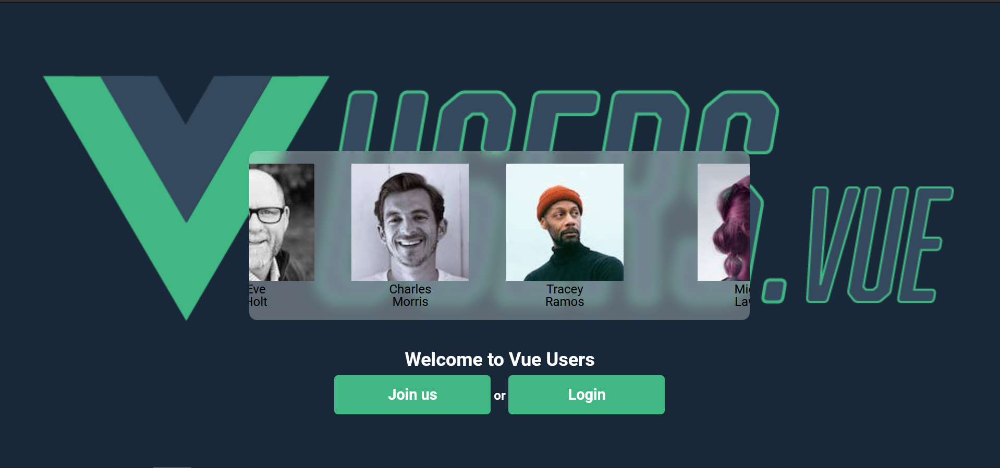
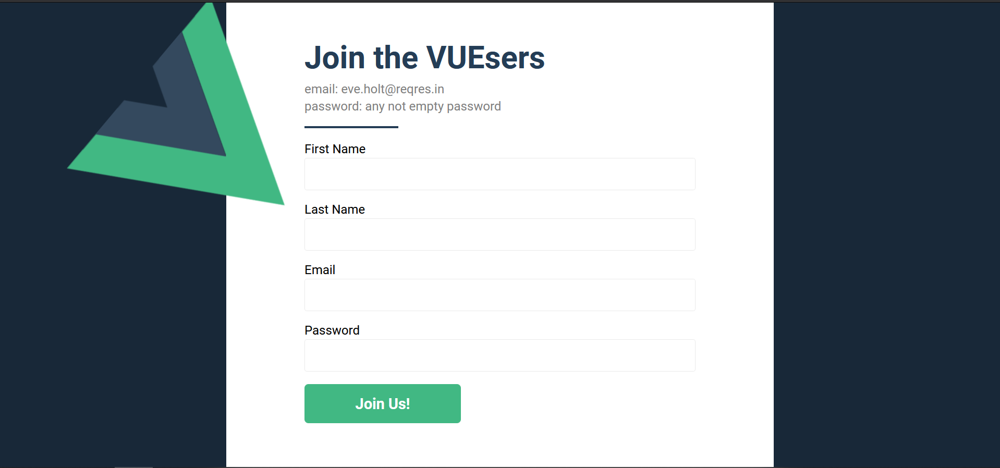
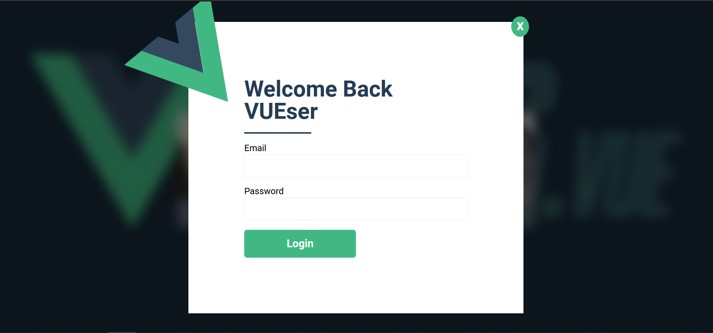
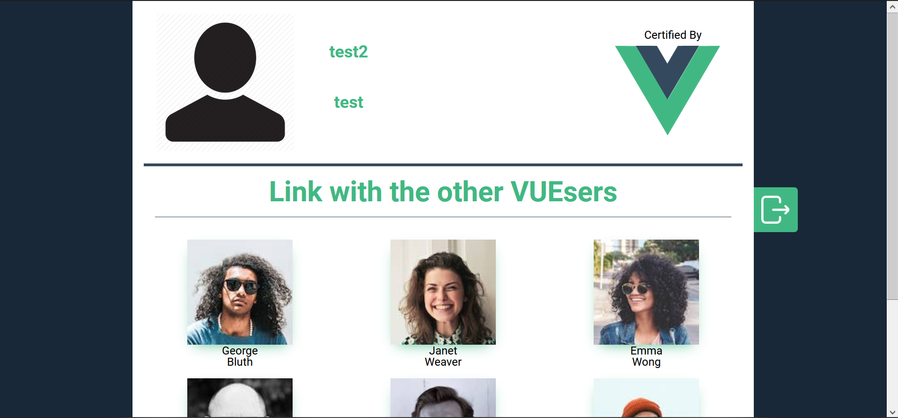
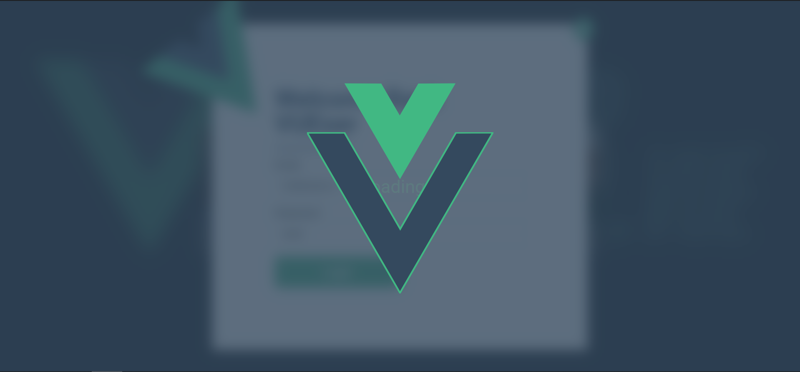

Site available at http://localhost:8080/
\
\
#YakkyoFy Front End Challenge
\
\
This is what i managed to develop with a basic knowledge of Vue.Js learnt in 2 days.
\
(Basics of Vue CLI, Vue UI, Vue-router, Vuex)
\
\
#App personalized name: VUEsers.vue
\
1.Landing Page (router-view)
\
  With a slider animated and users info taken from reqres.in api as requested
\
\

\
\
\
2.Registration Page (router-view)
\
  New user will be created through POST method to reqres.in/api/users endpoint and save to localStorage
\
  since new users are not persistent in the API
\
\

\
\
\
3.Login Modal
\
  I opted for a login modal component to not go to another different page.
\
  Login based on filtering localStorage new users. And message will be displayed in the modal if
\
  credentials will not be found
\
\

\
\
\
4.User Page (router-view)
\
  User detail dedicated page. 
\
  Header with basic info of the user.
\
  Pagination of other users (composition of users taken from reqres.in + new users in localStorage except the current
\
  logged user).
\
\

\
\
\
5.Loader
\
  Loader animated made with Vue Logo (edited with Adobe Illustrator).
\
  It will be displayed during registration and login process.
\
\

\
\
\
#THANKS FOR THE OPPORTUNITY AND THE CHALLENGE
